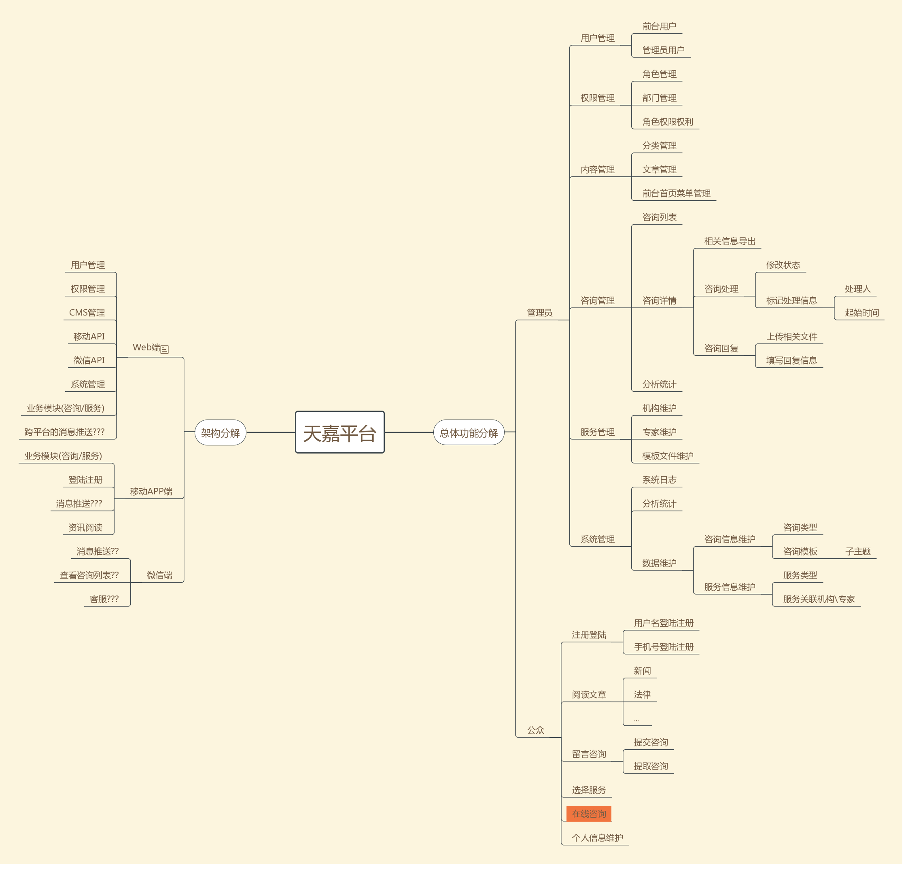

#### 1. 功能及架构分解

#### 2. Web端技术选型
Web端选型时需要考虑因素如下:
1. 界面自适应
2. 主题活泼时尚
3. 移动端API对接
4. 微信端对接
5. 框架稳定,开发效率高

#### 3. APP讨论
1. 跨平台开发框架?
2. 原生+webview的混合模式?
3. 技术分析
4. Web端需要配合功能

#### 4. 微信端讨论
1. 具体实现功能
2. 实现方案
3. Web端需要配合功能
